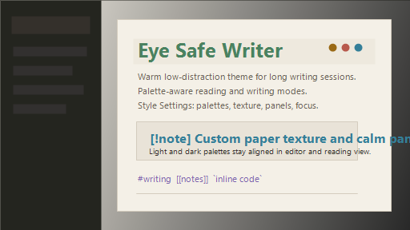

# Eye Safe Writer

Warm, low-distraction Obsidian theme for long writing sessions.



## Features

- Light and dark palettes tuned for eye comfort.
- Style Settings palette selector: Salvia, Gruvbox, AMOLED, Tokyo Night, Rose Pine, Solarized, Nord, Cappuccino.
- Full UI token system controlling workspace, text, accents, navigation, code, tables, callouts, and focus states.
- Typography, line width, headings, links, UI density, panels, shadows, and paper texture controls.
- Writing focus mode with reduced visual distraction.
- Built-in compatibility layer for productivity workflows.
- Eye Safe Pomodoro integration snippet for focused writing sessions.
- Reduced-motion, high-contrast, forced-colors, print, and small-screen support.

## Install

1. Copy `Eye Safe Writer` into `.obsidian/themes/`.
2. Enable the theme in Obsidian Appearance settings.
3. Install the Style Settings plugin for advanced customization.
4. For Pomodoro support, enable `snippets/eye-safe-pomodoro.css` from Obsidian CSS snippets.

## Recommended Workflow

Eye Safe Writer works well with:

- Obsidian Style Settings for theme customization.
- Pomodoro Timer plugins for timed deep-work sessions.
- Focus mode plugins for distraction-free writing.
- Daily notes, Canvas, Tasks, and markdown-based knowledge management.

## Style Settings

Available controls:

- Palette variants and light/dark themes.
- Manual colors for links, accents, tags, emphasis, and headings.
- Heading styles.
- Typography scale and reading width.
- UI density.
- Panel appearance.
- Paper textures.
- Writing focus intensity.

## Pomodoro Integration

The included `eye-safe-pomodoro.css` snippet provides:

- Calm timer cards matching the current theme palette.
- Large readable countdown typography.
- Soft buttons and reduced visual noise.
- Reduced-motion accessibility support.

It is designed to work with modern Obsidian Pomodoro plugins without changing plugin functionality.

## QA Checklist

- Obsidian desktop on Windows, macOS, Linux.
- Obsidian mobile and narrow layouts.
- Light and dark mode.
- Sidebar, ribbon, tabs, search, backlinks, graph, canvas, settings, modals.
- Zoom 80%, 100%, 150%.
- Keyboard navigation and focus states.
- Reduced motion, high contrast, forced colors, print/export.

## Release

- Update `manifest.json` version.
- Add entry to `CHANGELOG.md`.
- Test supported Obsidian workflows.
- Update screenshots when releasing major visual changes.

## Community Theme Submission

```json
{
  "name": "Eye Safe Writer",
  "author": "Nicola",
  "repo": "nicolamoscufo/eye-safe-writer"
}
```
